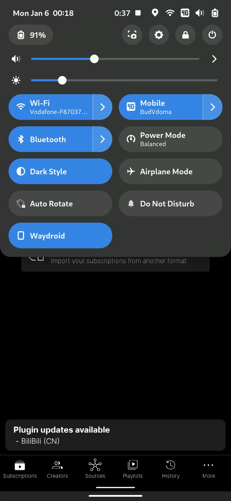
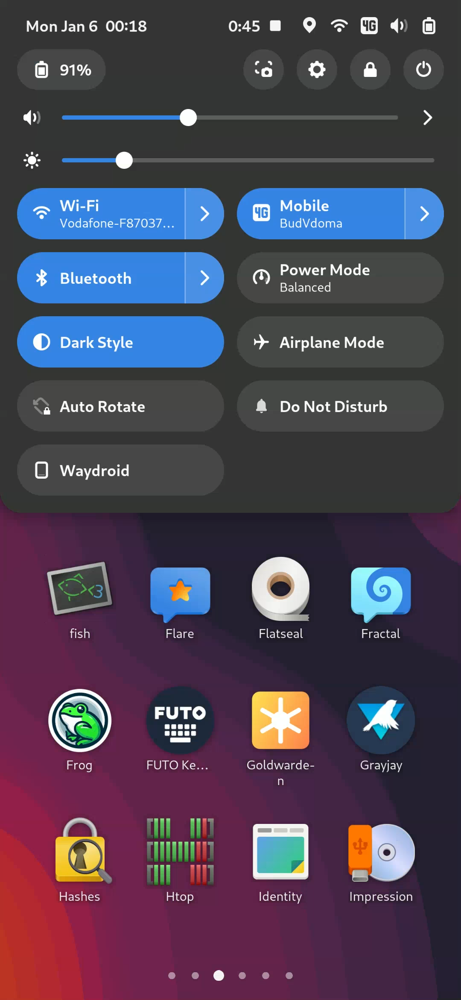
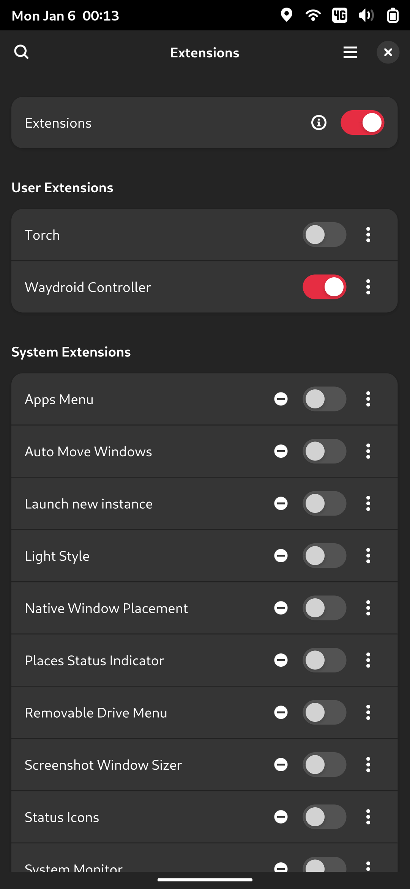

# GNOME Waydroid Controller

Quick Settings toggle to control Waydroid Android container sessions.

## Screenshots

{width=20%}
{width=20%}
{width=20%}

## Installation

Clone the repository directly into your GNOME Shell extensions directory:

```bash
git clone https://github.com/zatevakhin/gnome-waydroid-ctl.git ~/.local/share/gnome-shell/extensions/gnome-waydroid-ctl@github.com.zatevakhin
```

> Log out and log back in, or restart GNOME Shell.

Enable the extension using Extensions app from launcher or trough CLI `$ gnome-extensions-app`.

## Features

- Simple Quick Settings toggle for Waydroid session control
- Start/Stop Waydroid sessions with a single click
- Shows current session status

## Requirements

- GNOME Shell 46,47
- Waydroid installed and configured

